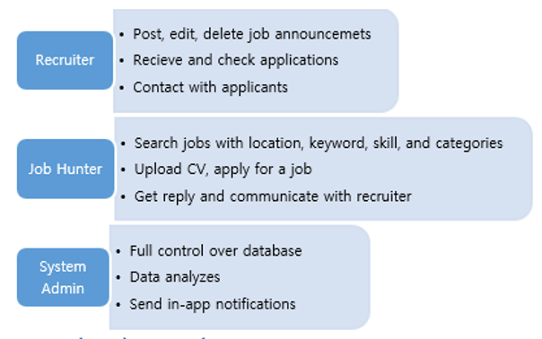
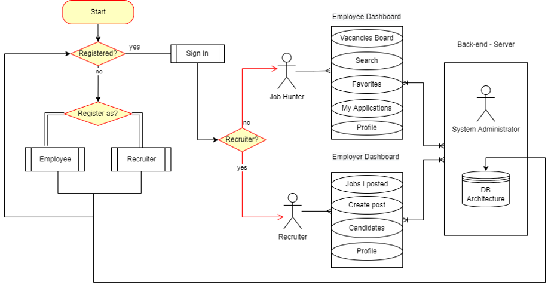
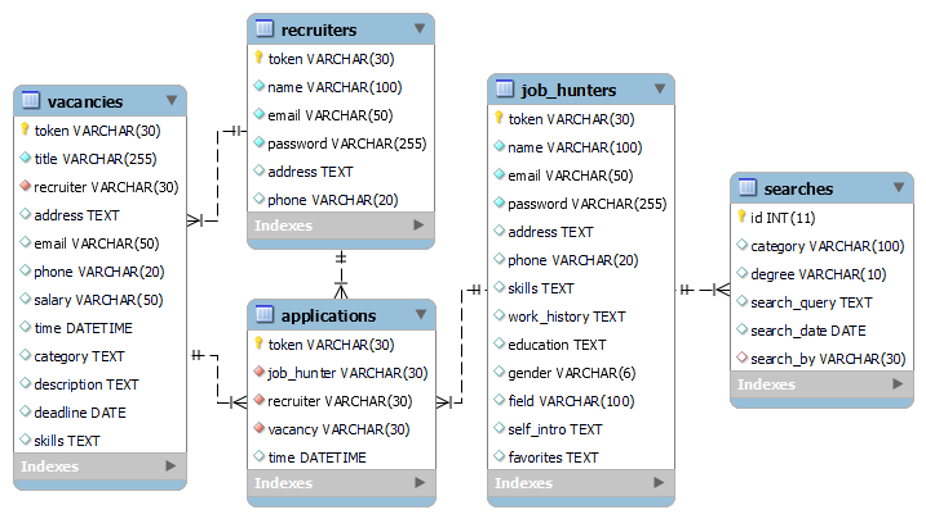
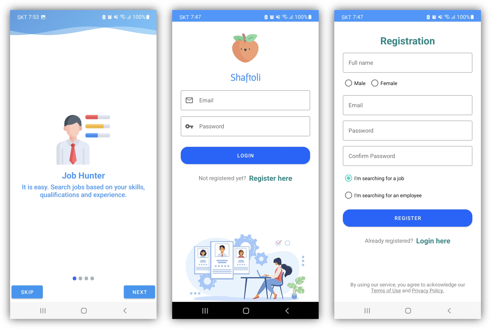
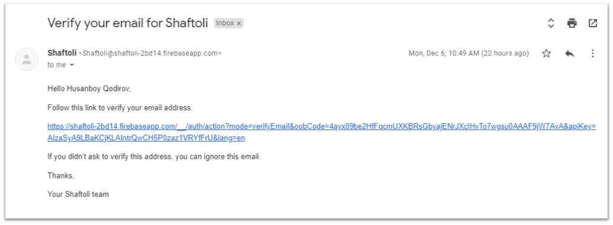
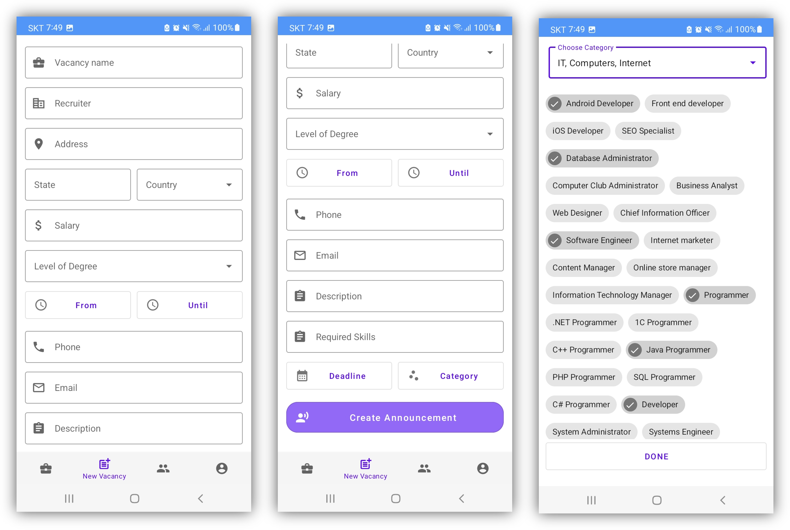
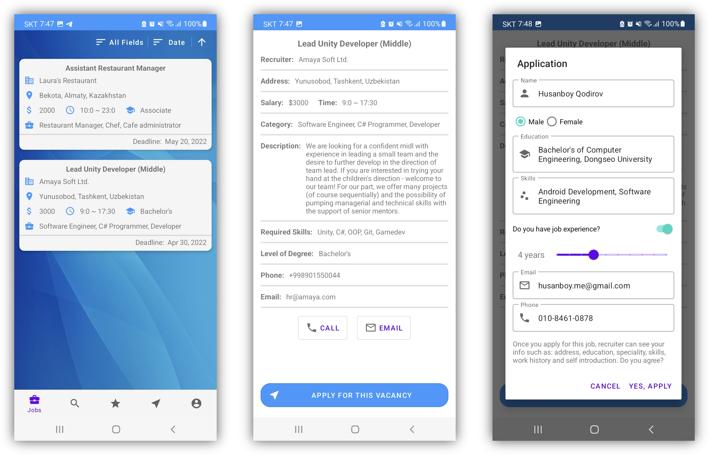
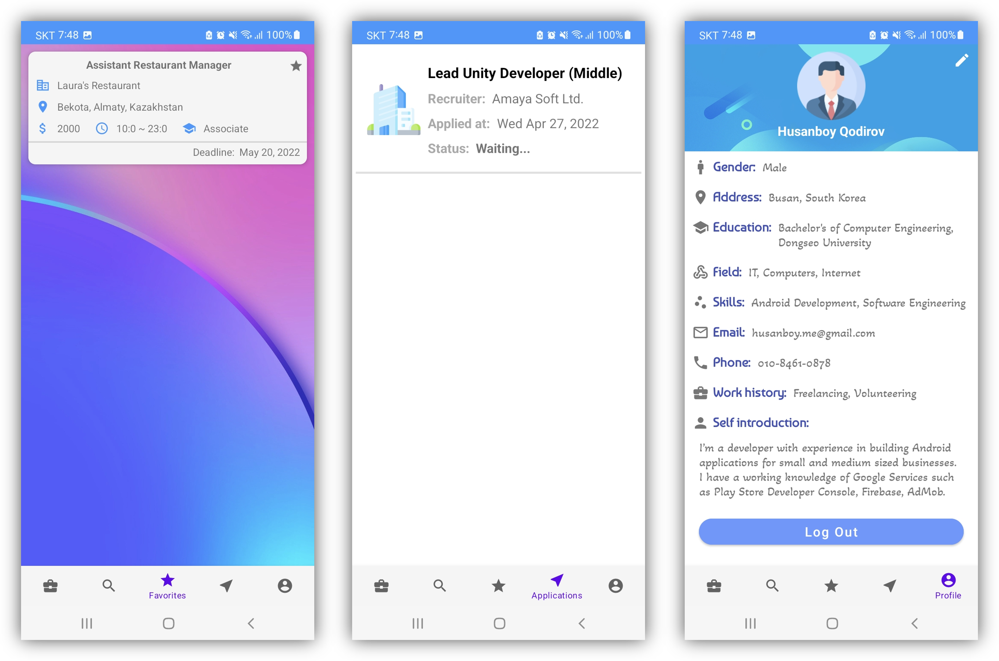
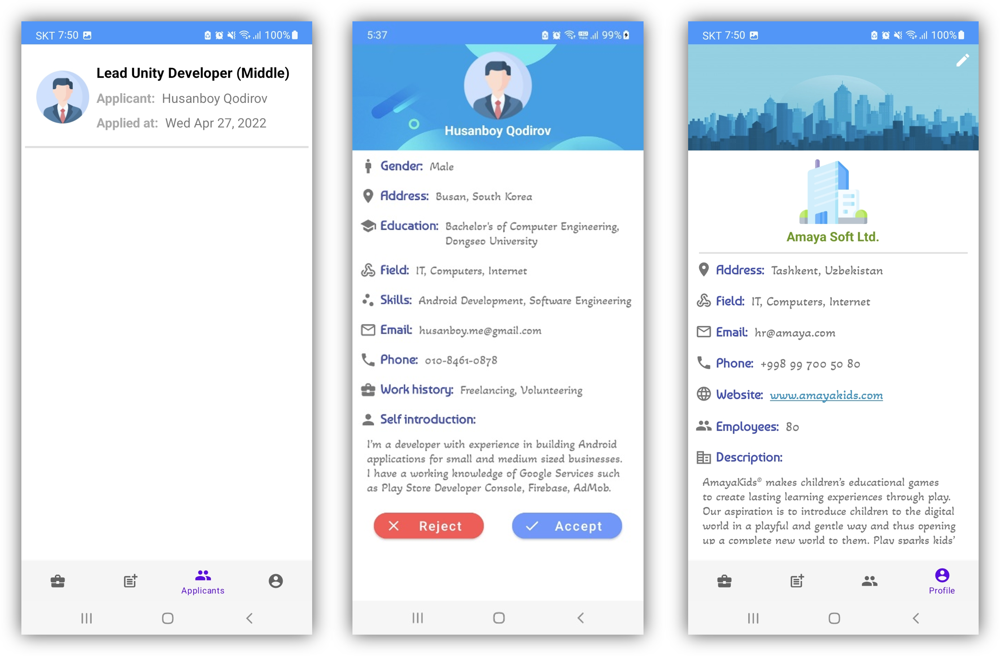

# Shaftoli

<html>

<h2>사용케이스</h2>

<h2>공정 흐름도</h2>

<h2>엔터티 관계 다이어그램</h2>

<h2>로그인, 가입</h2>

<h2>이메일 확인</h2>

<h2>채용 공고를 만드는 채용 담당자</h2>

<h2>구직 활동을 하는 구직자</h2>

<h2>구직자가 저장한 즐겨찾기, 입사지원 현황, 사용자 프로필</h2>

<h2>채용 담당자가 후보자를 검토합니다. 유저 프로필</h2>

</html> 
